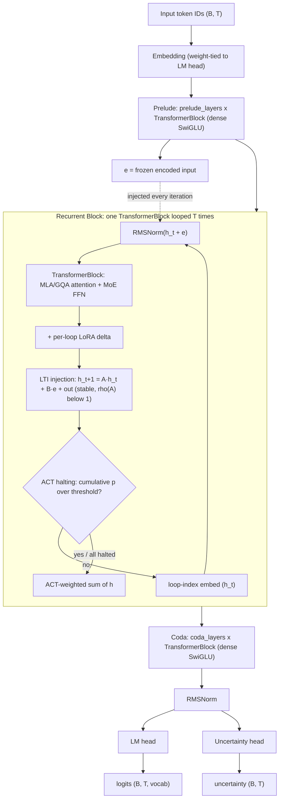

# `MythOuro` — Class Reference

**Module:** `mythouro.main`  
**Base class:** `torch.nn.Module`

---

## Overview

`MythOuro` is the top-level model class implementing the Recurrent-Depth Transformer (RDT) architecture described in [the MythOuro hypothesis](../README.md). It assembles three functional stages — **Prelude**, **Recurrent Block**, and **Coda** — into a complete autoregressive language model.

```
Input token IDs  (B, T)
        ↓
   [Embedding]          token index → dim-dimensional vector
        ↓
   [Prelude]            prelude_layers × standard TransformerBlock  (run once)
        ↓
   [Recurrent Block]    one TransformerBlock looped T times
        ↑___________↓   h_{t+1} = A·h_t + B·e + Transformer(h_t, e)
        ↓
   [Coda]               coda_layers × standard TransformerBlock  (run once)
        ↓
   [RMSNorm → LM head]
        ↓
Output logits  (B, T, vocab_size)
```



Every architectural choice in `MythOuro` can be configured through a single [`MythOuroConfig`](#mythosconfig) dataclass passed at construction.

> **Config note (2026-06-20):** the default values shown throughout this doc
> (`vocab_size=32000`, `dim=2048`, `n_experts=64`, …) are the **production
> template** — illustrative of the architecture, *not* the on-disk model. The
> **currently-trained checkpoints are `distill_tiny`**: ~278M params, **`vocab_size=49152`**
> (the SmolLM2/Ouro tokenizer — logit-KD requires the teacher's vocab), with a
> smaller `dim`. See `mythouro/variants.py` for the real variant configs and
> `docs/training_runs.md` for what's actually been trained.

---

## `MythOuroConfig`

```python
@dataclass
class MythOuroConfig
```

All hyperparameters for the model are stored in this single frozen-style dataclass. Pass an instance to `MythOuro.__init__`.

### Core fields

| Field | Type | Default | Description |
|---|---|---|---|
| `vocab_size` | `int` | `32000` | Token vocabulary size; sets the embedding and LM head dimension |
| `dim` | `int` | `2048` | Model hidden dimension — the width of the residual stream throughout |
| `n_heads` | `int` | `16` | Number of query attention heads |
| `n_kv_heads` | `int` | `4` | Number of key/value heads (GQA only); `n_heads // n_kv_heads` Q heads share each KV pair |
| `max_seq_len` | `int` | `4096` | Maximum sequence length; RoPE frequencies are precomputed up to this length |
| `max_loop_iters` | `int` | `16` | Default recurrent loop depth T at inference. Can be overridden per call |
| `prelude_layers` | `int` | `2` | Number of standard transformer blocks run once before the recurrent loop |
| `coda_layers` | `int` | `2` | Number of standard transformer blocks run once after the recurrent loop |

### Attention fields

`attn_type` selects between two complete attention implementations. All other attention fields are implementation-specific.

| Field | Type | Default | Description |
|---|---|---|---|
| `attn_type` | `str` | `"mla"` | `"gqa"` for Grouped Query Attention; `"mla"` for Multi-Latent Attention |
| `kv_lora_rank` | `int` | `512` | **[MLA only]** Compressed KV latent rank stored in the cache instead of full K and V |
| `q_lora_rank` | `int` | `1536` | **[MLA only]** Compressed Q latent rank |
| `qk_rope_head_dim` | `int` | `64` | **[MLA only]** Per-head dimension receiving RoPE positional encoding |
| `qk_nope_head_dim` | `int` | `128` | **[MLA only]** Per-head dimension without positional encoding |
| `v_head_dim` | `int` | `128` | **[MLA only]** Per-head value dimension |

**GQA vs MLA:** GQA reduces KV cache by having fewer KV heads than Q heads (factor of `n_heads / n_kv_heads`). MLA achieves a much larger reduction by caching a low-rank KV latent (`kv_lora_rank`) and the RoPE keys (`n_heads × qk_rope_head_dim`), then reconstructing full K and V on the fly. At production scale MLA yields roughly 10–20× smaller KV cache than standard attention.

### MoE FFN fields

The Mixture-of-Experts FFN is used exclusively inside the Recurrent Block. Prelude and Coda use a dense SwiGLU FFN.

| Field | Type | Default | Description |
|---|---|---|---|
| `n_experts` | `int` | `64` | Total number of routed expert FFNs |
| `n_shared_experts` | `int` | `2` | Always-active shared experts; absorb common cross-domain patterns |
| `n_experts_per_tok` | `int` | `4` | Top-K routed experts selected per token by the router |
| `expert_dim` | `int` | `512` | Hidden dimension inside each fine-grained routed expert |

Approximately `n_experts_per_tok / n_experts = 6.25%` of routed expert parameters are activated per token, plus all shared expert parameters.

### Stability and adaptation fields

| Field | Type | Default | Description |
|---|---|---|---|
| `act_threshold` | `float` | `0.99` | ACT cumulative halting threshold; loop exits per-position once this is exceeded |
| `rope_theta` | `float` | `500000.0` | RoPE base frequency (LLaMA-3 default; higher = slower frequency decay over sequence positions) |
| `lora_rank` | `int` | `16` | Rank of the depth-wise LoRA adapter applied inside each loop iteration |
| `recurrent_state_noise` | `float` | `0.0` | Training-only σ·RMS(h) Gaussian noise on the recurrent state each loop. Anti-collapse regulariser (replaces the accidental P0.1 noise). `0` = off. |
| `use_sandwich_norm` | `bool` | `False` | Huginn-style extra post-sublayer RMSNorm in every TransformerBlock. Changes architecture (carried in cfg_dict); fresh runs only. **Demoted** — targets a recurrent collapse we don't have (see `review_action_plan.md`). |
| `use_depth_aware_init` | `bool` | `False` | Takase/Huginn depth-aware init: residual-output projections (attn `wo`, FFN `down`) get std²=1/(5·h·l). Fresh runs only. |

> **Diagnostic-only runtime attribute (not a cfg field):**
> `RecurrentBlock.inference_noise` (default `False`) — when set, applies
> `recurrent_state_noise` at *eval* too. Used by `tools/collapse_metrics.py`
> `--inference-noise` to probe the exposure-bias spiral; not a training/cfg knob.
>
> **Generation degeneration (2026-06-16):** free generation of undertrained
> checkpoints spirals into a repetition attractor (*exposure bias*), NOT a
> hidden-state collapse — the recurrent representations stay healthy. See
> `training_runs.md` (06-16) and `references.md`.

---

## Constructor

```python
MythOuro(cfg: MythOuroConfig)
```

Builds all sub-modules, precomputes RoPE frequency buffers, and runs weight initialization.

**What happens internally:**

1. `nn.Embedding(vocab_size, dim)` — token embedding table, weight-tied with the LM head.
2. RoPE buffers — `freqs_cis` (for GQA, dim = `dim // n_heads`) and `freqs_cis_mla` (for MLA, dim = `qk_rope_head_dim`) are precomputed once and registered as non-parameter buffers. The correct buffer is selected at forward time based on `cfg.attn_type`.
3. `prelude` — `nn.ModuleList` of `prelude_layers` `TransformerBlock` instances with dense SwiGLU FFN.
4. `recurrent` — a single `RecurrentBlock` containing one `TransformerBlock` (with MoE FFN), `LTIInjection`, `ACTHalting`, and `LoRAAdapter`.
5. `coda` — `nn.ModuleList` of `coda_layers` `TransformerBlock` instances with dense SwiGLU FFN.
6. `RMSNorm(dim)` applied before the LM head.
7. `nn.Linear(dim, vocab_size, bias=False)` LM head with weights tied to the embedding.
8. All `nn.Linear` and `nn.Embedding` weights initialized from N(0, 0.02).

**Example:**

```python
from mythouro.main import MythOuro, MythOuroConfig

cfg = MythOuroConfig(
    vocab_size=32000,
    dim=2048,
    n_heads=16,
    n_kv_heads=4,
    max_loop_iters=16,
    attn_type="mla",
)
model = MythOuro(cfg)
print(f"Parameters: {sum(p.numel() for p in model.parameters()):,}")
```

---

## `forward`

```python
def forward(
    self,
    input_ids: torch.Tensor,
    n_loops: Optional[int] = None,
    kv_cache: Optional[dict] = None,
    start_pos: int = 0,
) -> tuple[torch.Tensor, torch.Tensor]
```

Single forward pass through the full Sink → Prelude → Recurrent Block → Coda pipeline. Returns logits **and** a per-token uncertainty score.

### Parameters

| Parameter | Type | Description |
|---|---|---|
| `input_ids` | `Tensor (B, T)` | Batch of token index sequences. `B` = batch size, `T` = sequence length |
| `n_loops` | `int \| None` | Recurrent loop depth for this call. Defaults to `cfg.max_loop_iters`. Pass a higher value at inference to extrapolate to harder problems (depth extrapolation property). |
| `kv_cache` | `dict \| None` | If provided, keys and values are accumulated here for autoregressive decoding. Pass `{}` on the first decode step and reuse the same dict across steps. Pass `None` for training or full-context inference. |
| `start_pos` | `int` | Caller-visible position of the first token in `input_ids` within the full sequence (0 for prefill, `prompt_len` for the second decode step, …). The internal sink-token offset is handled automatically. |

### Returns

A tuple `(logits, uncertainty)`:
- `logits` — `Tensor (B, T, vocab_size)`, raw (unnormalized) logits over the vocabulary for each position.
- `uncertainty` — `Tensor (B, T)`, per-token confidence-of-error in `(0, 1)` from `UncertaintyHead`. Trained to predict `1 - is_correct` via the calibration loss, so a value near `1` means the model is unsure of its argmax at that position.

### Behavior walkthrough

```
1. Embed:     x = embedding(input_ids)              # (B, T, dim)
2. Sink prepend (prefill only, start_pos == 0):
     x, sink_len = sink.prepend(x)                  # (B, n_sink + T, dim)
     rope_start  = 0
   Otherwise (decode steps):
     sink_len    = 0
     rope_start  = sink.n_tokens + start_pos
3. Select RoPE buffer at correct offset:
     freqs = freqs_cis[mla?][rope_start : rope_start + T_ext]
4. Build causal mask (upper-triangular -inf):
     if T_ext > 1: mask = _causal_mask(T_ext, device, dtype)
     else:         mask = None
5. Prelude:
     for i, layer in prelude:
         x = layer(x, freqs, mask, kv_cache, f"prelude_{i}")
6. Freeze encoded input:
     e = x                                          # (B, T_ext, dim)
7. Recurrent loop:
     x = recurrent(x, e, freqs, mask, n_loops, kv_cache)
8. Coda:
     for i, layer in coda:
         x = layer(x, freqs, mask, kv_cache, f"coda_{i}")
9. Sink strip (prefill only):  x = sink.strip(x)    # (B, T, dim)
10. normed = norm(x)
11. logits      = lm_head(normed)                   # (B, T, vocab_size)
    uncertainty = uncertainty_head(normed)          # (B, T) in (0, 1)
```

**Step 5 (freeze `e`)** is the key architectural invariant: the encoded input `e` is captured after the Prelude and injected at *every* loop iteration unchanged. This prevents the hidden state from drifting away from the original input signal regardless of loop depth.

### Training example

```python
import torch
from mythouro.main import MythOuro, MythOuroConfig

model = MythOuro(MythOuroConfig()).cuda()
optimizer = torch.optim.AdamW(model.parameters(), lr=3e-4)

input_ids = torch.randint(0, 32000, (2, 512)).cuda()
labels    = torch.randint(0, 32000, (2, 512)).cuda()

logits, uncertainty = model(input_ids)       # (2, 512, 32000), (2, 512)
loss   = torch.nn.functional.cross_entropy(
    logits.view(-1, 32000),
    labels.view(-1),
)
loss.backward()
optimizer.step()
```

### Depth extrapolation at inference

A looped transformer trained on `N` loops can be evaluated on `N + k` loops and often achieves higher quality on hard multi-hop problems. Pass `n_loops` at inference time:

```python
# Trained with max_loop_iters=16 — try deeper reasoning at test time
logits_deep, _ = model(input_ids, n_loops=32)
```

---

## `generate`

```python
@torch.no_grad()
def generate(
    self,
    input_ids: torch.Tensor,
    max_new_tokens: int = 64,
    n_loops: int = 8,
    temperature: float = 1.0,
    top_k: int = 50,
) -> torch.Tensor
```

Autoregressive token generation with KV caching. Processes the full prompt on step 0, then decodes one token at a time using the accumulated cache.

### Parameters

| Parameter | Type | Default | Description |
|---|---|---|---|
| `input_ids` | `Tensor (B, T)` | — | Prompt token indices |
| `max_new_tokens` | `int` | `64` | Number of new tokens to generate |
| `n_loops` | `int` | `8` | Recurrent loop depth per decode step. Can be higher than the training value for harder prompts (depth extrapolation) |
| `temperature` | `float` | `1.0` | Softmax temperature applied to logits before sampling. Values < 1 make the distribution more peaked (less random); values > 1 make it flatter |
| `top_k` | `int` | `50` | Restricts sampling to the top-K most probable tokens at each step. `0` disables filtering (full vocabulary sampling) |

### Returns

`Tensor (B, T + max_new_tokens)` — the original prompt concatenated with the generated token indices.

### KV caching mechanism

On step 0, the full prompt `(B, T)` is passed and all keys/values for every layer are populated in `kv_cache`. On steps 1…N only the single most recent token `(B, 1)` is passed; the attention layers read back all prior K/V from the cache. This makes decode cost proportional to a single token per step rather than the full growing sequence.

Each layer caches under a deterministic string key (`"prelude_0"`, `"recurrent_loop_3"`, `"coda_1"`, etc.), so caches from different layers never collide.

### Sampling strategy

```
logits = forward(cur_ids, n_loops, kv_cache)[:, -1, :] / temperature

if top_k > 0:
    threshold = logits.topk(top_k).values[:, -1:]
    logits[logits < threshold] = -inf

probs    = softmax(logits)
next_tok = multinomial(probs, num_samples=1)
```

### Generation example

```python
import torch
from mythouro.main import MythOuro, MythOuroConfig

model = MythOuro(MythOuroConfig()).eval()

# Tokenized prompt (use your tokenizer of choice)
prompt = torch.tensor([[1, 450, 3118, 310, 278]])   # (1, 5)

output = model.generate(
    prompt,
    max_new_tokens=128,
    n_loops=16,        # deeper reasoning
    temperature=0.8,
    top_k=40,
)
# output.shape == (1, 133)
```

---

## Internal Components

The following sub-modules are assembled inside `MythOuro`. They are not typically called directly but understanding them clarifies the model's behavior.

### `RecurrentBlock`

The heart of the architecture. A single `TransformerBlock` (with MoE FFN) is run in a loop for up to `n_loops` iterations, with the following per-iteration pipeline:

```
h_loop = loop_index_embedding(h, t, loop_dim)   # inject sinusoidal loop-index signal
combined = RMSNorm(h_loop + e)                   # add frozen encoded input
trans_out = TransformerBlock(combined, ...)       # attention + MoE FFN
trans_out = trans_out + LoRAAdapter(trans_out, t) # depth-wise LoRA delta
h = LTIInjection(h, e, trans_out)               # stable update: A·h + B·e + trans_out
p = ACTHalting(h)                                # per-position halting probability
```

The loop exits early for positions whose cumulative halting probability exceeds `cfg.act_threshold`. If all positions have halted, the loop exits before `n_loops`. The final output is an ACT-weighted sum of `h` across iterations.

### `LTIInjection`

Implements the stable recurrent update rule `h_{t+1} = A·h_t + B·e + transformer_out`. The diagonal matrix `A` is parameterized as:

```
A_continuous = Diag(-exp(log_A))     # always negative diagonal
A_discrete   = exp(Δt · A_continuous) # ZOH discretization, values ∈ (0, 1)
```

This guarantees spectral radius `ρ(A) < 1` by construction, making the looped model unconditionally stable regardless of learning rate or batch noise. See [Parcae (Prairie et al., 2026)](https://arxiv.org/abs/2604.12946) for the theoretical foundation.

### `ACTHalting`

A single linear layer mapping `(B, T, dim) → (B, T)` followed by sigmoid. At each loop step, the scalar halting probability per position is accumulated. When the cumulative sum exceeds `cfg.act_threshold`, the ACT remainder trick assigns the remaining probability mass as the final weight and the position stops contributing. Implements Graves (2016) ACT.

### `LoRAAdapter`

A depth-wise low-rank adapter with three components:

- `down`: shared `Linear(dim, rank)` — down-projects the transformer output
- `B`: shared parameter matrix `(rank, dim)` — up-projects back to full dimension
- `scale`: `Embedding(max_loops, rank)` — per-loop element-wise scale

The delta per iteration is `(down(x) * scale[t]) @ B`. Bridges the expressiveness gap between pure weight-tying and fully distinct per-layer weights. Based on [Relaxed Recursive Transformers (Bae et al., 2024)](https://arxiv.org/pdf/2410.20672).

### `TransformerBlock`

Pre-norm transformer block with swappable attention and FFN:

- **Attention:** `MLAttention` (MLA) or `GQAttention` (GQA), selected by `cfg.attn_type`
- **FFN:** `MoEFFN` (when `use_moe=True`, inside `RecurrentBlock`) or dense `Expert` (Prelude, Coda)
- Pre-norm via `RMSNorm` applied to both the attention input and FFN input

### `MLAttention`

Multi-Latent Attention ([DeepSeek-V2, 2024](https://arxiv.org/abs/2405.04434)). The cache stores only the compressed KV latent `c_kv` (rank `kv_lora_rank`) plus the RoPE-encoded keys. At each decode step, `K_nope` and `V` are cheaply reconstructed from `c_kv` via a shared up-projection, trading a fast linear multiply for dramatically smaller KV memory footprint.

Cache size per layer per token: `kv_lora_rank + n_heads × qk_rope_head_dim` vs. full GQA cache of `n_kv_heads × head_dim × 2`.

### `GQAttention`

Grouped Query Attention ([Ainslie et al., 2023](https://arxiv.org/abs/2305.13245)). `n_kv_heads` KV pairs are shared across `n_heads // n_kv_heads` query heads each, reducing KV cache by that factor while preserving full query expressiveness.

### `MoEFFN`

Fine-grained Mixture-of-Experts FFN ([DeepSeekMoE, Dai et al., 2024](https://arxiv.org/abs/2401.06066)):

- **Routed experts:** `n_experts` small SwiGLU FFNs. Each token's router selects the top-`n_experts_per_tok` via softmax over learned logits. A per-expert bias `router_bias` (non-gradient, updated externally) keeps load balanced.
- **Shared experts:** `n_shared_experts` always-active FFNs with width `expert_dim × n_experts_per_tok`, absorbing cross-domain patterns.

Total activated parameters per token: `(n_experts_per_tok / n_experts)` of routed capacity + all shared capacity.

### `Expert`

Single SwiGLU feed-forward unit: `down(silu(gate(x)) * up(x))`. Used both as individual routed experts inside `MoEFFN` and as the dense FFN in Prelude/Coda blocks.

### `RMSNorm`

Root Mean Square Layer Normalization ([Zhang & Sennrich, 2019](https://arxiv.org/abs/1910.07467)). Normalizes by `x / rms(x)` with a learned per-channel rescaling weight. No bias, no mean subtraction. Used throughout in place of standard LayerNorm.

---

## Utility functions

### `precompute_rope_freqs(dim, max_len, theta)`

Precomputes complex-valued RoPE rotation matrices as a `(max_len, dim//2)` complex64 tensor. Called once in `__init__` and stored as a buffer.

### `apply_rope(x, freqs_cis)`

Applies precomputed RoPE frequencies to a query or key tensor by treating adjacent feature pairs as complex numbers and multiplying pointwise by the positional phasor.

### `loop_index_embedding(h, loop_t, loop_dim, theta)`

Injects a sinusoidal loop-index signal into the first `loop_dim` channels of the hidden state, analogous to RoPE but over recurrence depth rather than sequence position. Allows the shared recurrent block weights to behave differently at different loop iterations.

---

## Key design properties

| Property | Mechanism | Benefit |
|---|---|---|
| Depth extrapolation | Recurrent block with looped identical weights | Train on N loops, test on N+k — harder problems solved without retraining |
| Parameter efficiency | Weight sharing across all loop iterations | k-layer model achieves quality of kL-layer model; parameters ≈ k, compute ∝ L |
| Adaptive compute | ACT halting per position | Easy tokens exit early; hard tokens receive full loop depth — within the same batch |
| Stable training | LTI injection with ZOH-constrained A (ρ(A) < 1) | No residual explosion; robust to high learning rates |
| Domain breadth | MoE FFN in recurrent block | Different expert subsets can be routed to at each loop depth |
| Loop differentiation | Loop-index sinusoidal embedding | Same weights implement functionally distinct phases per iteration |
| Efficient KV memory | MLA (default) or GQA | MLA: 10–20× smaller cache vs standard attention at production scale |
| Depth-wise adaptation | LoRA adapter per loop iteration | Expressiveness beyond pure weight-tying; minimal parameter overhead |

---

## Full configuration reference

The default `MythOuroConfig()` targets a mid-scale research model. Below is a minimal configuration for quick experimentation:

```python
from mythouro.main import MythOuro, MythOuroConfig

# Minimal config for fast iteration / unit testing
small_cfg = MythOuroConfig(
    vocab_size=8192,
    dim=256,
    n_heads=4,
    n_kv_heads=2,
    max_seq_len=512,
    max_loop_iters=4,
    prelude_layers=1,
    coda_layers=1,
    attn_type="gqa",
    n_experts=8,
    n_shared_experts=1,
    n_experts_per_tok=2,
    expert_dim=64,
    lora_rank=4,
)
model = MythOuro(small_cfg)
```

And a production-oriented MLA configuration matching the default hyperparameters:

```python
# Default MLA config (matches MythOuroConfig() defaults)
prod_cfg = MythOuroConfig(
    vocab_size=32000,
    dim=2048,
    n_heads=16,
    n_kv_heads=4,
    max_seq_len=4096,
    max_loop_iters=16,
    prelude_layers=2,
    coda_layers=2,
    attn_type="mla",           # Multi-Latent Attention
    kv_lora_rank=512,
    q_lora_rank=1536,
    qk_rope_head_dim=64,
    qk_nope_head_dim=128,
    v_head_dim=128,
    n_experts=64,
    n_shared_experts=2,
    n_experts_per_tok=4,
    expert_dim=512,
    act_threshold=0.99,
    rope_theta=500000.0,
    lora_rank=16,
)
model = MythOuro(prod_cfg)
```

---

## References

| Component | Paper |
|---|---|
| Recurrent-Depth Transformer | [Loop, Think, & Generalize (Kohli et al., 2026)](https://arxiv.org/abs/2604.07822) |
| LTI-stable injection (Parcae) | [Scaling Laws for Stable Looped Language Models (Prairie et al., 2026)](https://arxiv.org/abs/2604.12946) |
| Looped transformer reasoning | [Reasoning with Latent Thoughts (Saunshi et al., 2025)](https://arxiv.org/abs/2502.17416) |
| Multi-Latent Attention | [DeepSeek-V2 (2024)](https://arxiv.org/abs/2405.04434) |
| Grouped Query Attention | [Ainslie et al., 2023](https://arxiv.org/abs/2305.13245) |
| Mixture-of-Experts FFN | [DeepSeekMoE (Dai et al., 2024)](https://arxiv.org/abs/2401.06066) |
| Adaptive Computation Time | [Graves, 2016](https://arxiv.org/abs/1603.08983) |
| Depth-wise LoRA | [Relaxed Recursive Transformers (Bae et al., 2024)](https://arxiv.org/pdf/2410.20672) |
| RMSNorm | [Zhang & Sennrich, 2019](https://arxiv.org/abs/1910.07467) |
| RoPE | [Su et al., 2021](https://arxiv.org/abs/2104.09864) |
| Universal Transformer (ACT basis) | [Dehghani et al., 2018](https://arxiv.org/pdf/1807.03819) |
| Continuous latent reasoning | [COCONUT (2024)](https://arxiv.org/abs/2412.06769) |


<!-- ===== moved from docs/roadmap.md (2026-06-27 doc reorg) ===== -->

## Shipped: best-of-trajectory emission (inference)

An inference-side experiment for getting more out of the existing depth
machinery *without retraining* — runnable today against v4/v5.

**What it is.** Standard decoding emits the recurrent block's ACT-weighted blend
over loops. Best-of-trajectory instead scores *every* loop depth with the
UncertaintyHead and emits the logits from whichever loop the head is most
confident about — "keep the best step you saw" rather than "loop more, then undo
a bad one." It avoids the trap where extra loops legitimately *raise* entropy on
genuinely hard tokens before they resolve.

**Implementation** (all default-off, normal path byte-for-byte unchanged):
- `RecurrentBlock` gains an opt-in `collect_trajectory` flag that stashes the
  per-loop hidden states in `last_trajectory`.
- `MythOuro.forward_trajectory(input_ids, n_loops)` runs each captured loop
  state through Coda + LM head + UncertaintyHead and returns
  `(logits_traj (B,T,K,V), unc_traj (B,T,K))`.
- `inference.BestOfTrajectoryGenerator` / `best_of_trajectory_generate` — B=1
  greedy/sampled decode that selects the argmin-uncertainty depth per token,
  with a `min_loops` floor and a `chosen_loops` telemetry trace.
- 8 tests in `tests/test_inference.py::TestBestOfTrajectory`.

**How to validate.** Run it against v4/v5 in the inspector and compare to the
default generator: does `chosen_loops` actually diverge from "always deepest"?
Does inspector behaviour (halt reasons, register) improve? It's a measurement
tool — keep it if the trace shows the head is discriminating usefully across
depths; the gibberish ceiling at this scale may mask the effect until the model
is larger.

**Caveat (the code-level subtlety).** Training returns `h_K`, not the weighted
sum, to defuse ACT λ-collapse; inference uses the blend. Best-of-trajectory adds
a *third* emission rule that reads per-loop states — so it's an inference-only
overlay, deliberately not wired into training.

**First results (2026-06-08, v4 + v5, `reports/inspect_v{4,5}.txt`).**
- **ACT caps usable depth at ~3, not the configured 4.** At `n_loops=4`, ACT
  halts *all* positions by loop ~2, so only **3 loops actually run** and loop 3
  never executes — on every prompt, both checkpoints. (An early "100% diverged
  from the deepest loop" reading was an artifact of comparing against loop 3,
  which never runs; the per-loop dump caught it. Real divergence is **35–90%**.)
- **The uncertainty-by-depth curve is mostly monotonic, with genuine interior
  dips on some prompts.** v5 trends *deeper = more confident* (min at the
  deepest-run loop); v4 has prompts where *shallower = more confident* (min at
  loop 0) — the two checkpoints have differently-shaped depth/confidence
  profiles. A couple of prompts (v5 fib + Roman-Empire) show a real interior
  dip at loop 1, where best-of-trajectory does non-trivial selection.
- **Takeaway:** best-of-trajectory is *not* a no-op, but it's also not a big win
  at this scale — it's partly "take the most-confident endpoint." The louder
  signal is the **ACT depth-collapse to ~3**: the deepest configured loop is
  dead weight. That's a concrete data point for the MoDr / depth-policy work
  (the depth decision wants tuning) and for revisiting the ACT halt threshold.

**Forced-depth probe (`--force-full-depth`, `reports/inspect_v{4,5}_forced*.txt`).**
The ACT-respecting run above can only observe loops ACT chose to run, so it
couldn't tell "loop 3 genuinely hurts" (Hyp. A) from "loop 3 never ran"
(Hyp. B). The `--force-full-depth` knob suppresses ACT's convergence + halt-all
early-exit during trajectory capture (pure measurement — no weight change, normal
path untouched) so the loop runs the full `n_loops` and we can score the skipped
loops. An `[A/B]` line then compares ACT's learned halt depth (`halt_step_mean`)
to where uncertainty actually bottoms out. Findings:

- **The answer is prompt-dependent — both hypotheses are true, per input.** On a
  *subset* of prompts the skipped loops *do* lower uncertainty below ACT's
  stopping point (Hyp. B — ACT halts too early): v5 "recurrent-depth…" and "2+2"
  both bottom at **loop 3** (past ACT's ~2.0 cutoff); v4 "fibonacci" likewise. On
  others uncertainty rises past loop ~2 (Hyp. A — ACT justified). So a *single*
  global ACT threshold is structurally wrong: the right depth varies by token.
- **Depth-extrapolation partially works (v5, `n_loops=8`, 2× trained depth).**
  Curves are non-monotonic ("wavy"), but on "recurrent-depth transformer is"
  uncertainty reaches its **global minimum at loop 7** (0.50), well past the
  trained depth of 4 — concrete evidence the model *can* use more depth than it
  was trained on for some inputs. Other prompts degrade past loop 4 (off-
  distribution: loop-index embeddings + per-loop LoRA were only trained for
  loops 0–3). So extrapolation is real but input-specific, not free.
- **Confirmed noise-free (greedy, `--top-k 1`, 40 tokens,
  `reports/inspect_v{4,5}_forced_n*_greedy.txt`).** The temperature-0.7 curves
  carried run-to-run noise, so we reran deterministically. The headline result is
  *stronger* under greedy, not weaker: for "recurrent depth transformer is" (v5,
  `n=8`) uncertainty decreases **strictly monotonically** loop 0→7
  `[0.76, 0.64, 0.60, 0.54, 0.48, 0.41, 0.39, 0.39]` (every step negative,
  flattening to ≈0 by loop 7 — i.e. converging, not bottoming early). 3 of 4 v5
  prompts hit their minimum at loop 7. So depth-extrapolation to **2× the trained
  depth genuinely lowers uncertainty** for continuation-style prompts; it's a real
  effect, not a sampling artifact. (Short-answer / factual prompts still prefer
  shallow — the prompt-dependence also survives greedy.) The
  `--temperature` / `--top-k` inspector knobs were added for exactly this.
- **Direct implication for MoDr.** "Right depth is prompt-dependent, sometimes
  shallow, sometimes 3, occasionally 7" is precisely the case a single learned
  halt threshold can't serve and a **per-token learned depth router can** — this
  probe is the empirical motivation for the MoDr direction below.

---

